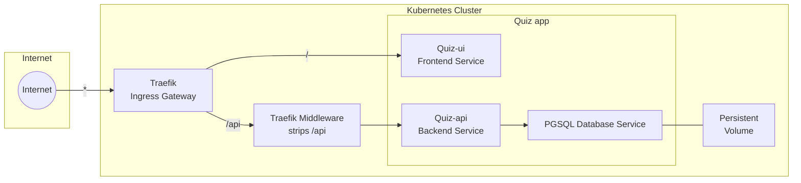

# Projet Virtualisation

Ce projet reprend un ancien projet de quiz dévelopé à l'ESIEE dans le cadre du cours développement frontend.
Le quiz est séparé avec une API back en Django et le front est en Vue, chacun avec leur image docker respective.
Pour les faire fonctionner avec kubernetes il a fallu modifier notamment le backend suite à une migration de sqlite vers Postgresql.

Plus de détails sur les déploiements Kubernetes et le code sont disponible dans le rapport.
Les quelques images de l'application sont disponibles dans le [rapport](Rapport.pdf).

## Architecture



## Prérequis

Avant de commencer, assurez-vous d'avoir installé les outils suivants :

- [Docker](https://docs.docker.com/get-docker/)
- [Minikube](https://minikube.sigs.k8s.io/docs/start/)
- [Helm](https://helm.sh/docs/intro/install/)

## Déploiement

### Construction des images Docker

Pour construire les images Docker, exécutez les commandes suivantes :

```bash
docker build -t my-quiz-api ./quiz-api
docker build -t my-quiz-ui ./quiz-ui
```

### Publication des images sur Docker Hub

Pour publier les images sur Docker Hub, utilisez les commandes suivantes :

```bash
docker tag my-quiz-api adham999/my-quiz-api
docker push adham999/my-quiz-api

docker tag my-quiz-ui adham999/my-quiz-ui
docker push adham999/my-quiz-ui
```

### Lancer Minkube

```bash
minikube start
```

### Utilisation de Traefik

Pour utiliser Traefik, installez-le avec Helm :

```bash
helm repo add traefik https://traefik.github.io/charts
helm repo update
helm install traefik traefik/traefik
```

### Déploiement sur Kubernetes

```bash
./deploy.sh
```

ou

```bash
kubectl apply -f my-quiz-namespace.yaml
kubectl apply -f my-quiz-ui-deployment.yaml
kubectl apply -f my-quiz-api-deployment.yaml
kubectl apply -f my-quiz-ui-service.yaml
kubectl apply -f my-quiz-api-service.yaml
kubectl apply -f my-quiz-ingress.yaml
kubectl apply -f my-quiz-postgres-pv.yaml
kubectl apply -f my-quiz-postgres-pvc.yaml   
kubectl apply -f my-quiz-postgres.yaml  
kubectl apply -f my-quiz-postgres-service.yaml  
```

### Accès au service

Pour accéder au service, exécutez la commande suivante :

```bash
minikube service traefik
```

Exemple de sortie :

```bash
|-----------|---------|-------------|------------------------|
| NAMESPACE |  NAME   | TARGET PORT |          URL           |
|-----------|---------|-------------|------------------------|
| default   | traefik |             | http://127.0.0.1:49585 |
|           |         |             | http://127.0.0.1:49586 |
|-----------|---------|-------------|------------------------|
```

Il suffit alors d'ouvrir l'un des deux URLs dans un navigateur, le premier est en HTTP et le second en HTTPS.
